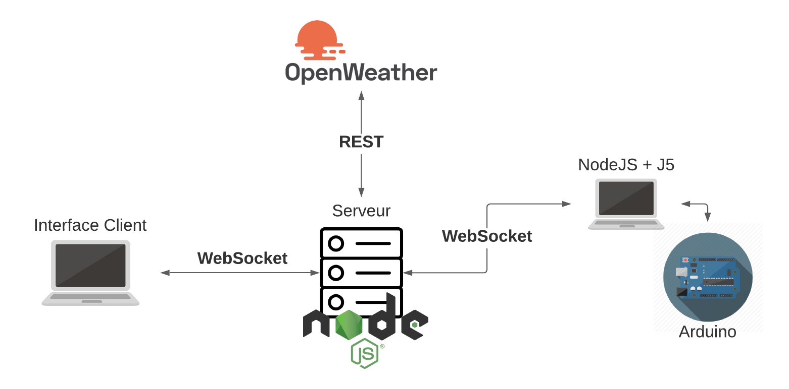
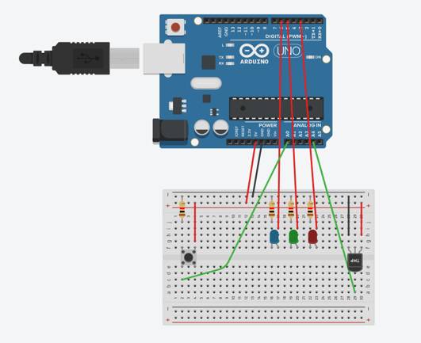

# TP 4 - IOT

## Groupe

    - SBAAI Abdelaziz p1807434
    - BOUGE Yoann p1711842
    - NASR Bechir p1926686
    - SOUGH Zakari p2018460

## Spec technique

Cette aplication utilise le bundler **Vite** pour garantir un temps de build plus rapide et un bundle size plus petit.

  

# Présentation du projet

L'idée du projet est de simuler le chauffage autonome d'une maison pour réguler sa température intérieure.

Le système sera composé d'un bouton, un capteur de température ainsi que 3 LEDs, une rouge, une bleu et une verte.

Une interface (ou le bouton physique) permettra à l'utilisateur de changer de mode de chauffage. Il pourra switch entre trois modes, le **mode activé**, le **mode manuel** ou le **mode vacances**.

Les deux LEDs représenteront le chauffage et la climatisation. Lorsque la LED rouge sera allumé cela signifira que le chauffage est allumé, et inversement, la LED bleu simulera l'état de la climatisation. La LED verte s'allumera lorsque la température ambiante est comme souhaité.

---

### Chauffage autonome

Le chauffage autonome possède 3 modes :

-   Le mode activé, s'occupera d'allumer le chauffage ou la climatisation pour réguler la température en fonction de la température intérieur. Le chauffage s'activera en dessous de 20°C et la climatisation au dessus de 25°C pour garder une température intérieur ambiante correcte.
-   Le mode manuel, permet à l'utilisateur d'activer le chauffage ou la climatisation à sa guise. 
-   Le mode vacances quant à lui, désactivera le chauffage et la climatisation.

## Architecture

---

### Architecture Logicelle

### Architecture matérielle

- 1x Arduino
- 3x LEDs (rouge, verte, bleu)
- 1x bouton
- 1x capteur de température

---

## Déploiement

-   https://tiw8-tp04.herokuapp.com

## API

Comme API externe nous utilisons [OpenWeatherMap API](https://openweathermap.org/api) pour afficher la méteo actuelle dans la carte de l'interface. 

#### Afficher la temperature actuel

-   URL : `https://tiw8-tp04.herokuapp.com/weather`
-   Methode : `GET`
-   Exemple : `curl -X GET https://tiw8-tp04.herokuapp.com/weather`

#### Afficher le mode actuel

-   URL : `https://tiw8-tp04.herokuapp.com/current_mode`
-   Methode : `GET`
-   Exemple : `curl -X GET https://tiw8-tp04.herokuapp.com/current_mode`

#### Modifier le mode actuel

-   URL : `https://tiw8-tp04.herokuapp.com/current_mode`
-   Methode : `POST`
-   Exemple : `curl -d '{"req_mode":"Mode vacances"}' -H "Content-Type: application/json" -X POST https://tiw8-tp04.herokuapp.com/current_mode`

## Guide de commandes

-   `yarn run build` : Créer un bundle de notre application en mode production
-   `yarn run start` : Lance le serveur express en mode production, il est fortement conseillé de lancer `yarn run build` avant
-   `yarn run dev` : Créer un bundle de notre application en mode developpement et lance le serveur Express

-   `git push heroku main` : Déploie l'application sur heroku (fonctionne uniquement sur la branche master ou main)
